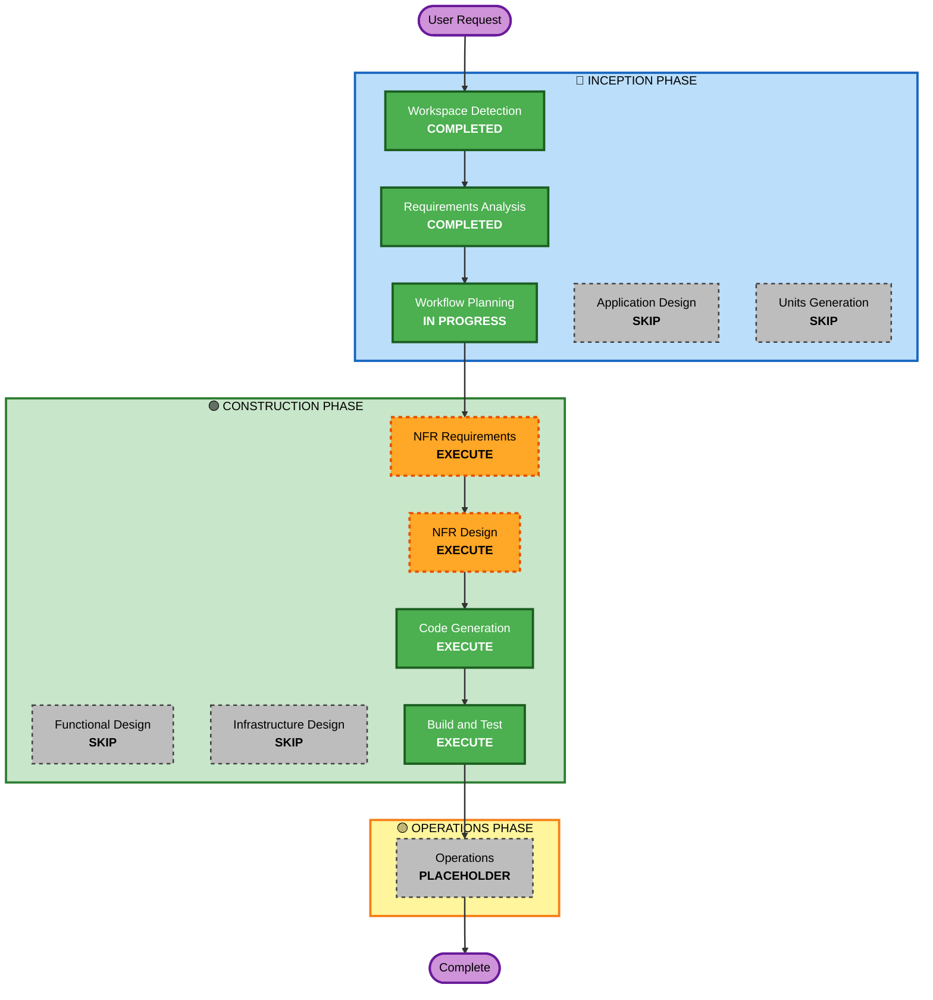

# Execution Plan

## Detailed Analysis Summary

### Project Type
- **Greenfield**: New REST API project from scratch
- **No existing codebase**: All components will be created

### Change Impact Assessment
- **User-facing changes**: Yes - Complete new API for blog post management
- **Structural changes**: Yes - New FastAPI application structure
- **Data model changes**: Yes - Blog post entity with tags relationship
- **API changes**: Yes - Five REST endpoints with specific contracts
- **NFR impact**: Yes - Security and testing requirements enabled

### Scope Assessment
- **Scope**: Single application component (REST API service)
- **Complexity**: Moderate - Multiple operations, pagination, filtering, tag management
- **Risk Level**: Low - Greenfield project with clear requirements, minimal dependencies
- **Rollback Complexity**: Easy - No existing systems to coordinate with

### Component Structure
- **Primary Component**: BlogPostsAPI (FastAPI application)
- **Persistence Layer**: SQLite database with SQLModel ORM
- **API Layer**: REST endpoints (create, read, list, update, delete)
- **Domain Layer**: BlogPost and Tag entities with relationships

---

## Workflow Visualization

---

## Phases to Execute

### 🔵 INCEPTION PHASE
- [x] Workspace Detection - **COMPLETED**
- [x] Requirements Analysis - **COMPLETED**
- [x] Workflow Planning - **IN PROGRESS**
- [ ] **Application Design - SKIP**
  - **Rationale**: Single application component with straightforward structure. No complex inter-component dependencies or architectural decisions needed beyond what requirements specify. Design is implicit in requirements.

- [ ] **Units Generation - SKIP**
  - **Rationale**: Single unit of work (REST API service). No need to decompose into multiple parallel units. Code generation will proceed with a single unit.

### 🟢 CONSTRUCTION PHASE
- [ ] **Functional Design - SKIP**
  - **Rationale**: Business logic is minimal and straightforward (CRUD operations with cursor pagination). Requirements are sufficient to proceed directly to code generation. No complex algorithms or state management requiring detailed design.

- [ ] **NFR Requirements - EXECUTE**
  - **Rationale**: Security baseline and property-based testing extensions are enabled. Must determine specific NFR implementations (security headers, input validation patterns, test framework selection).

- [ ] **NFR Design - EXECUTE**
  - **Rationale**: Incorporate security patterns (error handling, validation, logging) and PBT framework selection into the application design before code generation.

- [ ] **Infrastructure Design - SKIP**
  - **Rationale**: Standalone Python process with SQLite database. No cloud infrastructure, load balancers, or complex deployment configuration. Application runs locally as specified in requirements.

- [ ] **Code Generation - EXECUTE** (Always)
  - **Rationale**: Generate complete application code including models, API endpoints, database layer, and comprehensive tests.

- [ ] **Build and Test - EXECUTE** (Always)
  - **Rationale**: Build instructions, test execution, and verification of all components.

### 🟡 OPERATIONS PHASE
- [ ] Operations - **PLACEHOLDER**
  - **Rationale**: Future deployment and monitoring workflows (not yet implemented)

---

## Summary of Execution

**Stages to Execute: 5**
1. NFR Requirements Assessment
2. NFR Design & Pattern Selection
3. Code Generation (Planning + Generation)
4. Build and Test

**Stages to Skip: 4**
- Application Design (clear single-component structure)
- Units Generation (single unit of work)
- Functional Design (straightforward business logic)
- Infrastructure Design (standalone Python process)

**Total Estimated Timeline**: 4-6 hours
- NFR Assessment: 30 minutes
- NFR Design: 1 hour
- Code Generation Planning: 1 hour
- Code Generation & Testing: 2-3 hours
- Build & Verification: 1 hour

---

## Quality Gates & Success Criteria

### Functional Completeness
- ✅ All five endpoints implemented (create, read, list, update, delete)
- ✅ Tag filtering and cursor-based pagination working
- ✅ Proper HTTP status codes (201, 200, 204, 400, 404, 500)
- ✅ Error responses with standard format

### Security Compliance
- ✅ All SECURITY rules verified and compliant
- ✅ Input validation on all parameters
- ✅ Error handling with no internal details exposed
- ✅ Application-level logging configured

### Testing Coverage
- ✅ Property-based tests for serialization round-trips
- ✅ Property-based tests for invariants (pagination, filtering)
- ✅ Example-based tests for critical business scenarios
- ✅ All tests passing in build verification

### Code Quality
- ✅ SQLModel ORM properly configured
- ✅ FastAPI best practices followed
- ✅ Type hints throughout
- ✅ Comprehensive docstrings
- ✅ Clean code structure with separation of concerns

---

## Next Steps After Approval

Upon your approval:

1. **Proceed to NFR Requirements Assessment** - Determine specific implementations for security patterns and PBT framework
2. **Execute NFR Design** - Design security headers, validation approach, error handling patterns
3. **Execute Code Generation** - Generate all application code and tests
4. **Execute Build & Test** - Verify all components work correctly
